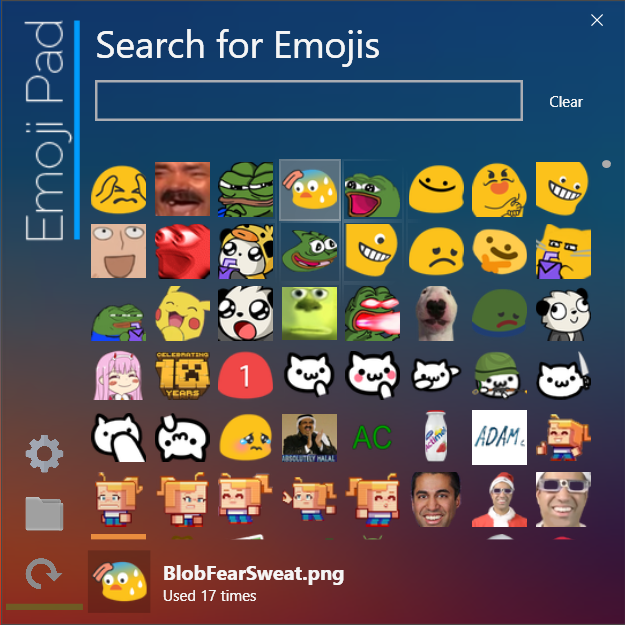

# EmojiPad

EmojiPad is an app designed for people who cannot afford Discord Nitro, or ones who want a more refined experience!

## Download EmojiPad

- Download the [latest release](https://github.com/encodeous/emojipad/releases) for Windows

## What is EmojiPad

EmojiPad is a highly configurable image clipboard application. EmojiPad organizes your favourite emojis together, and provides a lightning-fast search to allow you to find the perfect emoji for any occasion! To get started, simply click the folder icon and paste in some emojis.

## Features

### Emoji Preview
EmojiPad offers an elegant preview of your emojis, similar to the Discord emoji picker. It is able to handle tens of thousands of emotes without slowing down.

### Emoji Search
EmojiPad offers a handy search feature, for those who like to store tens of thousands of emojis!

### Emoji Clipboard
Once you have found the emoji you want, you can simply click it to copy it to your clipboard. The image will be automagically rescaled to the size of your choice, to ensure that you have a consistent emoji size. By default, the size is configured to be exactly the same as Discord's emoji size.

### Copy Statistics
Every time you copy an emoji, the app will keep track of it, and you can see how many times you have used it. The most used emojis will be shown on the top of the emoji list.

### Quick Access
EmojiPad allows you to bind a hotkey to quickly open the emoji picker. This makes it 10000 times easier to use EmojiPad! _(That's an accurate statistic, BTW)_ Never will you have to dig through your start menu, or tray icons just to find a single emoji.

