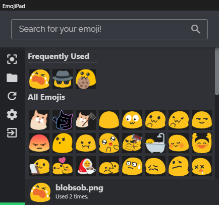

# EmojiPad

EmojiPad is an alternative to Discord Nitro, and other emoji services for people who cant afford it :(

## Download EmojiPad

- Download the [latest release](https://github.com/encodeous/emojipad/releases) for Windows

## What is EmojiPad

EmojiPad is a highly configurable image clipboard application. Specify a folder for EmojiPad to look for all images (`png or jpeg`) contained in it. EmojiPad organizes the most commonly used emojis into a separate category (like Discord), and updates in real-time.

## Features

- Frequently Used Emojis
- Customizable Paste Resolution
- Launch on a Keybind
- Hot-swap emojis in the folder
- Supports image transparency
- Customizable emoji folder
- Regular Expressions in search
- Auto Hide window after copying
- Little tray icon to show, or exit the app

## Configuration

Configuration of the app may be done in the settings menu.

Options include:

- Emoji paste size (pixels): `Specifies the maximal square bounds the emoji is allowed to fill`
- Frequent emoji count: `The maximal number of emojis to show in the favourite section of the picker`
- EmojiPad launch keybind: `A Hotkey that will show the picker when EmojiPad is hidden`
- EmojiPad emoji folder path: `The folder that contains all the emojis, NOTE: currently EmojiPad does not support sub-folders`
- Show window on EmojiPad start: `Should the EmojiPad window be shown when it starts?`
- Run on user login: `Should EmojiPad start automatically?`
- Auto hide window after copy: `Should the emoji picker be hidden after an image is picked?`
- Use Regex patterns in search: `Should the search bar match regex instead of regular characters?`
- Show EmojiPad ontop of other apps: `Self Explanatory`
- Hide EmojiPad when it has lost focus: `Should EmojiPad be hidden when the user clicks into another window?`

Saving these options require a full application restart.

## Compiling

EmojiPad requires dotnet core and aspnet core along with [https://github.com/ElectronNET/Electron.NET](https://github.com/ElectronNET/Electron.NET "Electron.NET") to build.

WHYYY ELECTRON? You may ask.

1. I wanted to make the UI look nice
2. Windows has this issue where the clipboard does not support transparency when pasting into Discord. I tried literally everything, and it did not work. If you know some way to do it, please let me know! For the time being, if you can't beat them, join them.
3. I wanted to learn something new!